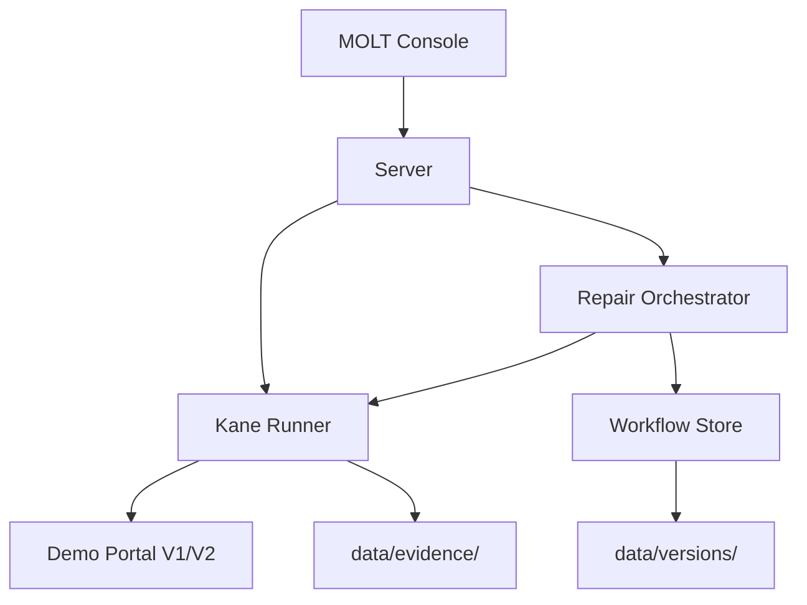

# MOLT

**Browser automations that repair themselves when websites change.**

MOLT stores goal-oriented Kane workflows. When UI drift causes failures, MOLT's repair agent automatically generates and validates new workflows, maintaining a complete evidence trail of all versions.

## Quick Start

```bash
# Install dependencies
npm install

# Start the server (serves both portal and console)
npm start
```

Then open:
- **MOLT Console**: http://localhost:3000
- **Demo Portal**: http://localhost:3000/portal

## Kane CLI Setup

MOLT requires the Kane CLI to be installed and authenticated:

```bash
# Install Kane globally
npm install -g @testmuai/kane-cli

# Login with your TestMu credentials
kane-cli login --username YOUR_USERNAME --access-key YOUR_ACCESS_KEY
```

Get your access key from [TestMu Settings → API Keys](https://app.testmu.ai/settings/keys).

## How It Works

### The Demo

The demo portal has two UI skins representing a realistic redesign scenario:

**V1 (Original)**: Billing → Invoices → Download
- Clean SaaS blue theme
- Heading: "Invoices"
- Button: "Download"

**V2 (Redesigned)**: Finance → Documents → Statements → Export PDF
- Dense finance dark/green theme
- Heading: "Statements"
- Button: "Export PDF"
- Additional navigation hop

Both accomplish the same goal (download invoice PDF) but with materially different information architecture.

### The Closed Loop

1. **Run on V1** → Workflow passes with exact-label assertions
2. **Deploy Redesign** → Portal switches to V2
3. **Run Again** → Workflow fails (exact labels gone) → UI DRIFT DETECTED
4. **Repair** → Kane explores current UI with goal-oriented instructions
5. **Patch** → New workflow generated with V2 labels
6. **Rerun** → Validation passes → v2 promoted, v1 preserved

### Architecture



**Components:**

- **Server** (`src/server.ts`): Express + WebSocket server orchestrating everything
- **Portal** (`src/portal/index.html`): Self-contained demo with V1/V2 skins
- **Console** (`src/client/index.html`): Real-time UI showing execution timeline
- **Kane Runner** (`src/kane/runner.ts`): Spawns Kane CLI, parses NDJSON, stores evidence
- **Repair Orchestrator** (`src/kane/repair.ts`): Closed-loop repair logic with bounded attempts
- **Workflow Store** (`src/store/workflow.ts`): Version management and assertion enhancement

## Project Structure

```
molt/
├── src/
│   ├── server.ts           # Main server with API + WebSocket
│   ├── client/
│   │   └── index.html      # MOLT console UI
│   ├── portal/
│   │   └── index.html      # Demo business portal
│   ├── kane/
│   │   ├── runner.ts       # Kane CLI integration
│   │   └── repair.ts       # Repair orchestration
│   ├── store/
│   │   └── workflow.ts     # Workflow versioning
│   └── __tests__/          # Unit tests
├── data/                   # Runtime state (gitignored)
│   ├── versions/           # Workflow versions (v1_test.md, v2_test.md)
│   ├── evidence/           # Kane run evidence (NDJSON, screenshots)
│   └── current_test.md     # Active workflow
├── fixtures/               # Committed test fixtures
│   ├── invoice.pdf
│   ├── kane-run-end-pass.ndjson
│   └── kane-run-end-fail.ndjson
├── package.json
└── README.md
```

## Scripts

```bash
npm start         # Start server (port 3000)
npm test          # Run unit tests
npm run portal-only  # Serve only portal (for testing Kane separately)
```

## For Judges

### Prerequisites

- Node.js 18+
- Chrome (for Kane)
- Kane CLI authenticated (see above)

### Demo Flow (3 minutes)

1. Open MOLT console → See V1 workflow ready
2. Click Run → Watch Kane execute → PASS on V1 portal
3. Click Deploy Redesign → Portal switches to V2
4. Click Run → Watch Kane fail → UI DRIFT DETECTED
5. Watch repair → Kane explores V2 → Generates new workflow
6. Watch rerun → PASS on V2 → NEW WORKFLOW PROMOTED
7. View workflow diff → Compare v1 vs v2 side-by-side
8. View evidence → See NDJSON, duration, step remarks

### What Makes This Special

**Kane is indispensable** because:

1. **Exact-label assertions** force real failure (not silently adapted)
2. **Goal-oriented repair** with actual exploration generates valid workflows
3. **Evidence trail** captures raw NDJSON + screenshots from real browser runs
4. **Bounded repair** (max 2 attempts) prevents infinite loops
5. **Version history** preserves all workflows with repair metadata

This is not a generic "verify with Kane" layer. It's a **workflow versioning system** that uses Kane's closed-loop capabilities to maintain automation in the face of real UI changes.

## Development

See `DEVELOPMENT_LOG.md` for implementation milestones and rubric scores.

## Eligibility

- Built for Kane CLI Online Hackathon (deadline 31 Aug 2026 23:59 IST)
- No secrets in git
- Single-command setup
- Pure Kane integration (no mocked results)

## License

MIT
